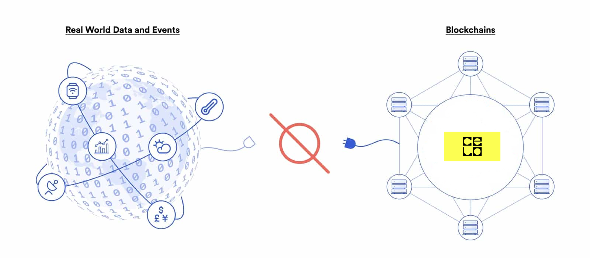

# Oracle-Tutorial

## Introduction

One of the greatest challenges of the blockchain technology was the issue of getting access to real world data, this data is often referred to as **off-chain data** and is basically any data that is external to a blockchain, such as sports scores, weather data, price feeds etc. This issue was due to the limitation of smart contracts as they cannot inherently interact with data and systems existing outside their native blockchain environment.



You may then wonder why were blockchains isolated from these external systems as obviously the external systems are well needed. Well this trade off allowed blockchains obtain their most valuable properties like strong consensus on the validity of user transactions, prevention of double-spending attacks, and mitigation of network downtime. So this issue created the need for secure interoperation with off-chain systems from a blockchain and that brings us to the topic of the tutorial **Oracles** "the bridge between the two environments".

Oracles on the blockchain are frameworks that allow for the blockchain world to interface with data from the rest of the web. They can not only give access to offchain-data but can provide a trust-minimized form of off-chain computation to extend the capabilities of blockchains like verifiable randomness, smart contract automation etc. This useful tool helped make users have countless ways to make blockchains useful in their day-to-day life.

So in this tutorial we're going to be building a simple on-chain weather oracle with solidity and node.js.

## Tech Stack

We will use the following tools and languages in this tutorial

1. Remix IDE
2. VS Code
3. A web browser
4. Node JS

## Prerequisites

- Basic knowledge of programming with Solidity
- Basic knowledge of using Remix
- Basic knowledge of javascript

## ORACLE Development

The oracle will be made up of two parts

- The on-chain oracle contract
- The off-chain oracle service

Here is a breakdown of how this two parts will combine to give us a working oracle:

1. The on-chain oracle emits an event with information about the job.

2. The off-chain oracle service listens for events about the job and pulls info when one is triggered.

3. Then the off-chain oracle interacts with any api service or data to receive result.

4. After that the off-chain oracle transacts with on-chain oracle contract to update data for the job.

5. Now the smart contract ecosystems can use the data for whatever it needs it for.

## On-chain Oracle

In this section we're going to be writing two contracts, the first one being the oracle contract itself, and the second being the consumer contract from which we'll make our requests, to test our oracle contract.

### Oracle Contract

To get started, hop on to remix and create a file `OnChainOracle.sol` and open it.

Now let's define the structure of the contract. The contract will contain the following:

- the address of the off-chain oracle (this should be immutable)
- the fee required to make the request.
- a constructor that helps us set the off-chain oracle address and the fee.
- an event that triggers the off-chain oracle and event to show that request has been completed.
- a function the consumer contract calls to make the weather request
- a function the off-chain oracle calls to supply us with the weather result.
- a nonce to help in generating a different requestID

```solidity
// SPDX-License-Identifier: MIT

pragma solidity ^0.8.0;

abstract contract OnChainOracle{

    uint256 private nonce;

    address private immutable offChainOracleAddress;

    uint256 private immutable fee;

    event newRequest(uint256 requestId, int256 lat, int256 lon);
    event requestCompleted(uint256 requestId, string temp);

    constructor(address _offChainOracleAddress, uint256 _fee) {
        offChainOracleAddress = _offChainOracleAddress;
        fee = _fee;
    }

    //function makeWeatherRequest(){}

    //function rawCompleteRequest(){}

    //function completeRequest(){}
}

```

If you look closely, you'd notice that the contract is marked as `abstract`, what this means is that we're basically telling the compiler that this contract has both defined and undefined functions.

But wait this wasn't specified in the structure of the contract. Yes it wasn't, but we'll go over it as we're defining the `rawCompleteRequest`.

let's define the `makeWeatherRequest` function;

```solidity
    function makeWeatherRequest(
        uint256 _lat,
        uint256 _lon
    ) internal returns (uint256) {
        (bool sent, ) = payable(offChainOracleAddress).call{value: fee}("");
        require(sent, "Failed to send Fee");
        uint256 requestId = uint(
            keccak256(abi.encodePacked(block.timestamp, msg.sender, nonce))
        );
        emit newRequest(requestId, _lat, _lon);
        nonce++;
        return requestId;
    }
```

Breakdown of the function

- It takes in two parameters from the caller, the latitude and the longitude as ints so it can support negative inputs from the caller, as the range for latitudes is -90 to 90 and -180 to 180 for longitudes
- Next we send the fee to the on chain oracle address so it doesn't run of funds to pay for gas.
- Next it generates a unique request Id, so the off-chain can be able to keep track of different requests. It uses a combination of the timestamp, caller address and the contract's nonce to generate this id. This ID is returned after the function is completed.
- Lastly it emits the trigger event so the off-chain oracle can get notified of a new requests, it sends the requestId along with the latitude and longitude. Then it increments the nonce.

Now let's define the `rawCompleteRequest` function;

```solidity
    function rawCompleteRequest(uint256 _requestId, string memory _temp) external {
        require(msg.sender == offChainOracleAddress, "No permission");
        completeRequest(_requestId, _temp);
        emit requestCompleted(_requestId, _temp);
    }

    function completeRequest(
        uint256 _requestId,
        int256 _temp
    ) internal virtual;
```

Recall when we made mention that the contract is marked as asbtract because it contains both defined and undefined function right? Well this is the reason why.

So we start the `rawCompleteRequest` function, this function is callable only by the off-ChainOracle address and what it does is to send the result of the request which is the temperature back to the contract. Then it calls the `completeRequest` function.

Let's just think of the `completeRequest` function like the plug-and-play devices we use at home where all we have to do is plug it in for it to work. Now say we have a consumer contract that uses our oracle, we have to assume they'd want to do something with the data gotten from the oracle, hence we have to create a way for them to just plug their contract into the oracle and from there they can manipulate the data however they want.

It is the undefined function in the oracle contract, is marked as `virtual` so that the inheriting contracts i.e. our consumers contract can then override it to define how they want to use it.

The onChain-oracle contract now looks like this;

```solidity
// SPDX-License-Identifier: MIT

pragma solidity ^0.8.0;

abstract contract OnChainOracle {
    uint256 private nonce;

    address private immutable offChainOracleAddress;

    uint256 private immutable fee;

    event newRequest(uint256 requestId, int256 lat, int256 log);
    event requestCompleted(uint256 requestId, string temp);

    constructor(address _offChainOracleAddress, uint256 _fee) {
        offChainOracleAddress = _offChainOracleAddress;
        fee = _fee;
    }

    function makeWeatherRequest(
        int256 _lat,
        int256 _lon
    ) internal returns (uint256) {
        (bool sent, ) = payable(offChainOracleAddress).call{value: fee}("");
        require(sent, "Failed to send Fee");
        uint256 requestId = uint(
            keccak256(abi.encodePacked(block.timestamp, msg.sender, nonce))
        );
        emit newRequest(requestId, _lat, _lon);
        nonce++;
        return requestId;
    }

    function rawCompleteRequest(
        uint256 _requestId,
        string memory _temp
    ) external {
        require(msg.sender == offChainOracleAddress, "Only oracle can call");
        completeRequest(_requestId, _temp);
        emit requestCompleted(_requestId, _temp);
    }

    function completeRequest(
        uint256 _requestId,
        string memory _temp
    ) internal virtual;
}
```

And that's it for the oracle contract.

### Consumer Contract

Now let's write our consumer contract, that allows us to test our onchain oracle contract. We're still in remix so create a new file `Consumer.sol`.

Here's a quick overview of what the contract will be doing;

- inherit the on-chain oracle contract
- which allows it to be able to make requests to the off-chain oracle
- then it stores the result of the requests

For a contract to inherit another contract, we use the `is` keyword when defining the name of the contract.

So in the consumer.sol file after defining the license and the solidity version, import the on chain oracle contract, then define the contract name with the `is` keyword.

```solidity
// SPDX-License-Identifier: MIT

pragma solidity ^0.8.0;
import "./OnChainOracle.sol";

contract Consumer is OnChainOracle { }
```

Okay!!!. Let's define the contract's structure: The contract will contain the following:

- a counter to keep track with the number of requests
- the fee required to make the request
- a struct containing the request information and status of the request
- mappings that help keep track of the requestIds to the requestData and their id in the counter.
- a `constructor` that sets the offChainOracleAddress and the fee.
- the `getWeather` function that makes the call
- the `completeRequest` function that helps us store the request result.
- the `viewRequest` function that helps us output the request data.

```solidity
// SPDX-License-Identifier: MIT

pragma solidity ^0.8.0;
import "./OnChainOracle.sol";

contract Consumer is OnChainOracle {
    uint256 public count;

    uint256 public fee;

    struct weatherRequest {
        int256 lat;
        int256 lon;
        bool status;
        string temp;
    }

    mapping(uint256 => weatherRequest) weatherRequests;

    mapping(uint256 => uint256) ids;

    constructor(
        address _offChainOracle,
        uint256 _fee
    ) OnChainOracle(_offChainOracle, _fee) {
        fee = _fee;
    }

    // function getWeather()  {}

    // function completeRequest() {}

    // function viewRequest()  {}
}

```

Let's define the `getWeather` function

```solidity
    function getWeather(int256 _lat, int256 _lon) external payable {
        require(msg.value >= fee, "not enough fee for request");
        uint256 requestId = makeWeatherRequest(_lat, _lon);
        weatherRequests[requestId] = weatherRequest({
            lat: _lat,
            lon: _lon,
            status: false,
            temp: "0"
        });
        ids[count] = requestId;
        count++;
    }
```

Breakdown of the function

- the function takes in the latitude and longitude from the user
- next it checks if the user attached enough fee to make the request
- then it makes the requests and creates a new weatherRequest object using the returned requestId as the key.
- it also stores a mapping of the counter to the requestId, for ease of retrievable as we can't memorize the generated requestId from the on chain oracle
- then it increments the counter

Next the `completeRequest` function

```solidity
    function completeRequest(
        uint256 _requestId,
        string memory _temp
    ) internal virtual override {
        require(!weatherRequests[_requestId].status, "Invalid Request ID");
        weatherRequests[_requestId].temp = _temp;
        weatherRequests[_requestId].status = true;
    }
```

Recall this is our plug and play function, so for the consumer contract to be able to define the function with it's own logic, it has to override the function and basically what this function does here is to:

- receive the input of the request result and check if that requestId exists in the mappings else revert
- then it updates the status of the request and stores the result.

It is marked as internal, as the only entry allowed is from the `rawCompleteRequest` function, which only the off-chain oracle address can call. Can you see the picture now?

Lastly the `viewRequest` function

```solidity
    function viewRequest(
        uint256 _countId
    ) external view returns (weatherRequest memory) {
        uint256 requestId = ids[_countId];

        return weatherRequests[requestId];
    }
```

This is a view function that outputs the request data when given a count number.

The complete consumer contract should like this now;

```solidity
// SPDX-License-Identifier: MIT

pragma solidity ^0.8.0;
import "./OnChainOracle.sol";

contract Consumer is OnChainOracle {
    uint256 public count;

    uint256 public fee;

    struct weatherRequest {
        int256 lat;
        int256 lon;
        bool status;
        string temp;
    }

    mapping(uint256 => weatherRequest) weatherRequests;

    mapping(uint256 => uint256) ids;

    constructor(
        address _offChainOracle,
        uint256 _fee
    ) OnChainOracle(_offChainOracle, _fee) {
        fee = _fee;
    }

    function getWeather(int256 _lat, int256 _lon) external payable {
        require(msg.value >= fee, "not enough fee for request");
        require(_lat <= 90 && _lon < 180, "Invalid location given");
        uint256 requestId = makeWeatherRequest(_lat, _lon);
        weatherRequests[requestId] = weatherRequest({
            lat: _lat,
            lon: _lon,
            status: false,
            temp: "0"
        });
        ids[count] = requestId;
        count++;
    }

    function completeRequest(
        uint256 _requestId,
        string memory _temp
    ) internal virtual override {
        require(!weatherRequests[_requestId].status, "Invalid Request ID");
        weatherRequests[_requestId].temp = _temp;
        weatherRequests[_requestId].status = true;
    }

    function viewRequest(
        uint256 _countId
    ) external view returns (weatherRequest memory) {
        uint256 requestId = ids[_countId];

        return weatherRequests[requestId];
    }
}
```

### Compiling and Deploying the Consumer Contract

Now let's compile and deploy the `Consumer.sol` contract. For the constructor parameter (the off-chain oracle service) use a wallet address that you have the private key, the fee I used was 0.1 celo i.e. `100000000000000000`. So users have to pay a fee of 0.1 celo in order to make a request.


## Off-chain Oracle Service

In this section we're going to create the JavaScript component of the oracle that listens to the events and makes the weather requests based on the information it gets.

### Setting Up

Open up your terminal and do the following:

- Check if your pc has Node.js installed from V16. or higher and NPM from V9. or higher.

```bash
$node --version

$npm --version
```

If you don't check out [NVM](https://github.com/nvm-sh/nvm#installing-and-updating) this allows you to install the both of them in just one go.

- Next create a new folder `oracle` and inside this folder run `npm init` then install the following packages
  - [ethers.js](https://www.npmjs.com/package/ethers) package
  - [dotenv](https://www.npmjs.com/package/dotenv) for environment variables
  - [axios](https://www.npmjs.com/package/axios) to help us make the requests.

```bash
$mkdir oracle
$cd oracle
$npm init
$npm install ethers dotenv axios
```

Next create a `.env` file, this file will contain the private key of the offChain-oracle and the address of the consumer contract we deployed on remix.

```env
PRIVAKE_KEY=""
CONSUMER_ADDRESS=""
```

Note: Do not expose your private key. Lost some funds due to that :sob:.

Next head back to the remix and copy the abi of the deployed contract, create a file `/contracts/consumer.abi.json` and paste the data in there.

Lastly in the root of the folder, create a file `index.js` this is where the oracle code will be in.

And that's it for the setup.

### Writing on-chain oracle

Let's open the index.js file and import all the necessary dependencies needed to run our off-chain oracle.

```js
require("dotenv").config();
const ethers = require("ethers");
const axios = require("axios");
const fs = require("fs");
const abi = require("./contracts/consumer.abi.json");

const consumerAddress = process.env.CONSUMER_ADDRESS;
const oraclePrivateKey = process.env.PRIVAKE_KEY;
const MAX_RETRIES = 3;
```

we get the consumer contract address and the off-chain oracle private key defined in the .env file and have defined a constant called `MAX_RETRIES` providing we have issues with the api, so the off-chain can make the call 3 more tries after which it responds with an error value.

Next let's create a connection to the CELO testnet, using the JSON RPC with url `https://alfajores-forno.celo-testnet.org`. Then create a walletSigner instance using the private key of the off-chain oracle address and the provider connection. Next define a const

```js
const walletSigner = new ethers.Wallet(oraclePrivateKey, provider);

const contract = new ethers.Contract(consumerAddress, abi, walletSigner);

```

Now let's create our functions, recall the off-chain oracle has three functions,

1. Listen for the `newRequest` event: Here we'll be using [ethers subscriber function](https://docs.ethers.org/v5/api/contract/contract/#Contract-on) which subscribes to event calling listener when the event occurs.

2. Request data from the api (the offchain database we're querying): The api we'll be using here is the [open meteo weather forecast api](https://open-meteo.com/en/docs)

3. Send the request result/data to the consumer contract.

Let's configure our off-chain oracle to be able to listen for the `newRequest` events:

```js
  contract.on("newRequest", async (requestId, lat, log) => {
    // query api
    // send data to consumer contract.
  });
```

Provided the oracle is running, whenever a `newRequest` event is emitted, the oracle will be able to get the data passed in via that event with this command. Inside it we can then parse the data however we want

Let's define the api function `getTemperature`

```js
async function getTemperature(lat, log) {
  console.log("Making API Call");
  let temp = 0;
  await axios
    .get(
      `https://api.open-meteo.com/v1/forecast?latitude=${lat}&longitude=${log}&current_weather=true`
    )
    .then((res) => {
      temp = res.data.current_weather.temperature;
    })
    .catch((err) => {
      console.log(`ERROR: ${err.message}`);
    });
  return temp.toString();
}
```

It is a simple function that uses axios to make the request, passing in the latitude and longitude to the api query, then returns the temperature of that location as a string.

Next let's define the function that sends the returned value to the on-chain consumer

```js
async function sendTemperatureData(requestId, temp) {
  console.log("Sending request response to the blockchain");
  const txn = await contract.rawCompleteRequest(requestId, temp);
  console.log(
    `Request completed for ${requestId} at transaction hash https://explorer.celo.org/alfajores/tx/${txn.hash}`
  );
  console.log(
    "----------------------------------------------------------------------------------------------------------------------"
  );
}
```

So joining everything together, we have:

```js
require("dotenv").config();
const ethers = require("ethers");
const axios = require("axios");
const abi = require("./contracts/consumer.abi.json");

const consumerAddress = process.env.CONSUMER_ADDRESS;
const oraclePrivateKey = process.env.PRIVAKE_KEY;

const provider = new ethers.providers.JsonRpcProvider(
  "https://alfajores-forno.celo-testnet.org"
);

const walletSigner = new ethers.Wallet(oraclePrivateKey, provider);

const contract = new ethers.Contract(consumerAddress, abi, walletSigner);

const MAX_RETRIES = 3;

async function getTemperature(lat, log) {
  console.log("Making API Call");
  let temp = 0;
  await axios
    .get(
      `https://api.open-meteo.com/v1/forecast?latitude=${lat}&longitude=${log}&current_weather=true`
    )
    .then((res) => {
      temp = res.data.current_weather.temperature;
    })
    .catch((err) => {
      console.log(`ERROR: ${err.message}`);
    });
  return temp.toString();
}

async function sendTemperatureData(requestId, temp) {
  console.log("Sending request response to the blockchain");
  const txn = await contract.rawCompleteRequest(requestId, temp);
  console.log(
    `Request completed for ${requestId} at transaction hash https://explorer.celo.org/alfajores/tx/${txn.hash}`
  );
  console.log(
    "-------------------------------------------------------------------------------------"
  );
}

async function processRequest(request) {
  let retries = 0;
  while (retries < MAX_RETRIES) {
    try {
      const temp = await getTemperature(
        Number(request.lat),
        Number(request.log)
      );
      await sendTemperatureData(request.requestId, temp);
      return;
    } catch (e) {
      if (retries === MAX_RETRIES - 1) {
        console.log("Failed to data from API");
        await sendTemperatureData(request.requestId, "0");
        return;
      }
      retries++;
    }
  }
}

(async () => {
  console.log("Oracle Service Started");
  console.log(
    "-------------------------------------------------------------------------------------"
  );
  contract.on("newRequest", async (requestId, lat, log) => {
    console.log(`New request with id ${requestId} for lat ${lat} lon ${log}`);
    const request = { requestId, lat, log };
    await processRequest(request);
  });
})();

```

I've added a few helper functions and consoles to help us manage the output and state of the off-chain oracle.

To get your off-chain oracle running, run the `node index.js` command in the root of the directory.

And Voila you have a full working oracle.

### Testing Oracle

Note: The start count was from 6, as I tested with deployed contract before making the video.


